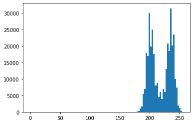
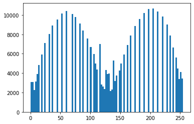
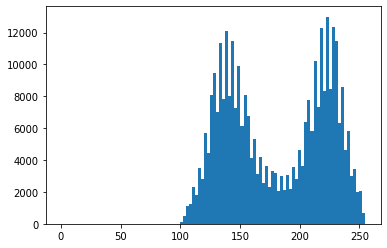

# Contrast Limited Adaptive Histogram Equalization (CLAHE)

CLAHE is a contrast enhancment algorithm. It is a preprocessing technique to make tasks like image thresholding, segmentation, object detection easier. Most of the contrast enhancement techniques rely on histogram modifications that can be applied both locally or globally. CLAHE overcomes the limitations of global approaches by enhancing local contrast. 

CLAHE works on small areas of an image called tiles rather than complete image. The surrounding tiles are blended using bilinear interpolation to remove false boundaries. 

Let's see an example. Below you can see an image collected by an electron microscope.

We can observe that there is some seperation in the image but it is not as clear. Let's view it's histogram.

## Histogram - Original Image

You can see the histogram of the original image below. We can see that it is skewed to the right side.

## Equalized Histogram 

Following is the histogram of the equalized version of the image. We can see that now the histogram is stretched throught.

## CLAHE Histogram
You can see the equalized histogram of the image after CLAHE application. We can see that the histogram is now equalized but it is slightly skewed towards the right just like the original image. 

## Conclusion

We can choose a threshold using the dip we observe in the CLAHE histogram which will in turn reduce the noise. We can use CLAHE to enhance the visibility of a foggy image or video. 